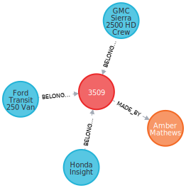

## Task 2

### Робота з базовими функціями граф-орієнтованої БД на прикладі Neo4j

#### Завдання 1

Знайти Items які входять в конкретний Order

```sql
MATCH x=(o:Order)<-[:BELONGS_TO]-(:Item)
WHERE o.id = '3462'
RETURN x
```


#### Завдання 2
Підрахувати вартість конкретного Order

```sql
MATCH (o:Order)<-[b:BELONGS_TO]-(i:Item)
WHERE o.id = '3462'
WITH toInteger(b.quantity) as quantity, toFloat(i.price) as price
RETURN sum(price * quantity)
```


#### Завдання 3
Знайти всі Orders конкретного Customer

```sql
MATCH x=(:Order)-[:MADE_BY]->(c:Customer)
WHERE c.id = '332'
RETURN x
```


#### Завдання 4
Знайти всі Items куплені конкретним Customer (через Order)

```sql
MATCH x=(:Item)-[:BELONGS_TO]->(:Order)-[:MADE_BY]->(c:Customer)
WHERE c.id = '332'
RETURN x
```



#### Завдання 5
Знайти кількість Items куплені конкретним Customer (через Order)

```sql
MATCH (i:Item)-[:BELONGS_TO]->(:Order)-[:MADE_BY]->(c:Customer)
WHERE c.id = '332'
RETURN count(i)
```


#### Завдання 6
Знайти для Customer на яку суму він придбав товарів (через Order)

```sql
MATCH (i:Item)-[b:BELONGS_TO]->(:Order)-[:MADE_BY]->(c:Customer)
WHERE c.id = '332'
WITH toInteger(b.quantity) as quantity, toFloat(i.price) as price
RETURN sum(quantity * price)
```


#### Завдання 7
Знайті скільки разів кожен товар був придбаний, відсортувати за цим значенням

```sql
MATCH (i:Item)-[b:BELONGS_TO]->(:Order)
WITH i.name as name, count(b) as c
RETURN name, c ORDER BY c DESC LIMIT 10
```


#### Завдання 8
Знайти всі Items переглянуті (view) конкретним Customer

```sql
MATCH x=(:Item)-[:VIEWED_BY]->(c:Customer)
WHERE c.id = '350'
RETURN x
```


#### Завдання 9
Знайти інші Items що купувались разом з конкретним Item (тобто всі Items що входять до Order-s разом з даними Item)

```sql
MATCH (i:Item)-[:BELONGS_TO]->(:Order)<-[:BELONGS_TO]-(n:Item)
WHERE i.id = '234408'
RETURN n
```


#### Завдання 10
Знайти Customers які купили даний конкретний Item

```sql
MATCH x=(i:Item)-[:BELONGS_TO]->(:Order)-[:MADE_BY]-(c:Customer)
WHERE i.id = '234408'
RETURN x
```


#### Завдання 11
Знайти для певного Customer(а) товари, які він переглядав, але не купив

```sql
MATCH x=(i:Item)-[:VIEWED_BY]->(c:Customer)
WHERE c.id = '350' AND NOT (i)-[:BELONGS_TO]->(:Order)-[:MADE_BY]-(c)
return x
```

